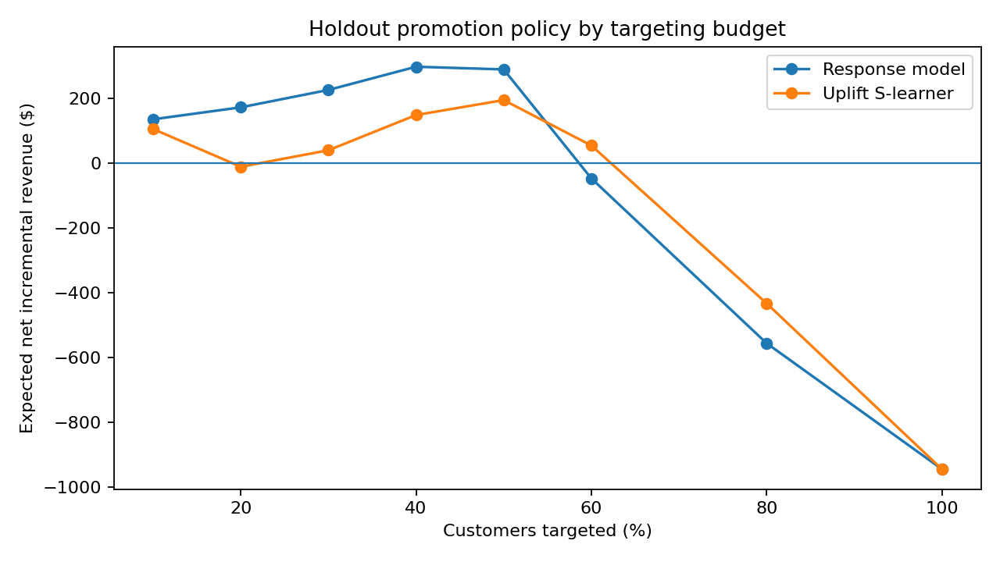

# PriceSense

**Who actually needs a promotion?**

PriceSense is a small data-science study of promotion targeting using a
randomized Starbucks/Udacity experiment. The goal is not simply to predict who
will purchase. It is to ask whether a promotion *causes enough additional
purchases to justify its cost*, and whether that effect can be targeted toward
the right customers.

<p align="center">
  
</p>

## Why this problem is interesting

A customer with a high purchase probability is not necessarily a good promotion
target. They may have purchased anyway. Conversely, a customer with moderate
purchase probability can be valuable if the promotion meaningfully changes
their decision.

The dataset makes that distinction testable because promotion assignment was
randomized.

PriceSense compares three decisions:

1. send the promotion to everyone;
2. target customers who look most likely to purchase after promotion;
3. estimate customer-level uplift and target customers with the largest
   predicted treatment effect.

The project intentionally stays small: one randomized experiment, two model
families, one held-out policy comparison, and one interactive HTML report.

## Dataset

The experiment contains **84,534 training customers** with:

- randomized `Promotion = Yes/No` assignment;
- binary `purchase` outcome;
- seven anonymized customer features (`V1`–`V7`).

In the original exercise, the product generates **$10** when purchased and
sending one promotion costs **$0.15**.

The raw dataset is not committed. Download it with:

```bash
python -m pricesense.data
```

The downloader retrieves the public copy of the Starbucks/Udacity promotion
exercise used for this analysis.

## Main result

The experiment itself clearly increased purchases:

| Metric | Result |
|---|---:|
| Control purchase rate | **0.756%** |
| Promotion purchase rate | **1.702%** |
| Incremental response rate | **+0.945 pp** |
| 95% bootstrap CI | **+0.792 to +1.080 pp** |
| z-statistic | **12.47** |
| p-value | **1.1e-35** |

But a statistically successful campaign is not automatically a profitable
campaign. Applying the promotion to all 84,534 customers gives an expected
**net incremental revenue of -$4,687.79** under the original exercise's revenue
and contact-cost assumptions.

### Targeted policy on the held-out test set

The data are split 60/20/20 into train, validation and test sets. Targeting
fractions are chosen on validation and evaluated once on the test set.

| Strategy | Fraction chosen on validation | Test incremental response | Test expected NIR |
|---|---:|---:|---:|
| Response model | **40%** | **+1.942 pp** | **+$298.58** |
| Uplift S-learner | **30%** | +1.580 pp | +$40.46 |
| Promote everyone | 100% | +0.941 pp | **-$945.15** |

The important conclusion is not that uplift modelling always wins. In this
experiment, purchases are very rare, so individual treatment-effect estimates
are noisy. The simpler response model transfers more reliably to the holdout
sample, while both targeted strategies are far better than indiscriminate
promotion.

That result is useful because it separates three questions that are often mixed
together:

- **Does the promotion work on average?** Yes.
- **Is it profitable to send to everyone?** No under the stated economics.
- **Can heterogeneous treatment effects be estimated reliably enough to beat a
  simpler targeting rule?** Not consistently here.

## Methods

### 1. Randomized experiment analysis

PriceSense computes the treatment/control purchase rates, incremental response,
a difference-in-proportions z-test and a bootstrap confidence interval.

### 2. Purchase-response baseline

A class-balanced random forest is trained on promoted customers only. It ranks
customers by their estimated probability of purchasing after promotion.

### 3. Uplift S-learner

A gradient-boosted classifier uses customer features and treatment assignment.
Each customer is scored twice—once assuming promotion and once assuming
control—and the difference is treated as predicted uplift.

### 4. Budget selection

Each model is evaluated at targeting fractions of 10%, 20%, 30%, 40%, 50%, 60%,
80% and 100%. The fraction with the highest validation-set NIR is frozen before
final evaluation on the test split.

More detail is in [`docs/methodology.md`](docs/methodology.md).

## Interactive report

After running the analysis, open:

```text
reports/dashboard.html
```

It opens directly in a browser (no local dashboard server is required) and shows:

- expected NIR as the targeting budget changes;
- response-model versus uplift-model policy curves;
- observed incremental response across uplift-score bands.

No dashboard server is required.

## Repository structure

```text
pricesense/
├── artifacts/
│   ├── policy_curve.png
│   ├── summary.json
│   ├── test_policy_curve.csv
│   ├── uplift_segments.csv
│   └── validation_policy_curve.csv
├── data/
│   └── README.md
├── docs/
│   ├── methodology.md
│   └── results.md
├── notebooks/
│   └── analysis.ipynb
├── reports/
│   └── dashboard.html
├── src/pricesense/
│   ├── analysis.py
│   ├── data.py
│   ├── experiment.py
│   └── models.py
└── tests/
```

## Reproduce the analysis

Python 3.10+ is recommended.

```bash
python -m venv .venv
source .venv/bin/activate
pip install -e .
python -m pricesense.data
python -m pricesense.analysis
pytest -q
```

`python -m pricesense.analysis` regenerates all committed summary tables,
figures and the standalone dashboard from the downloaded dataset.

## Limitations

- `V1`–`V7` are anonymized, so the project can discover heterogeneous response
  but cannot attach business meaning to individual covariates.
- Purchase is rare, making individual uplift estimates noisy.
- Offline subgroup estimates are not a substitute for validating a targeting
  policy in a new randomized experiment.
- The exercise assigns a fixed value to purchases and promotion contacts; a
  real pricing system would model margin, discount depth, repeat purchases and
  longer-term customer effects.

## Data attribution

The analysis uses the public Starbucks promotion experiment distributed through
Udacity's data-science exercise. A reproducible downloader is included rather
than redistributing the raw data in this repository.

## License

Project code is released under the MIT License. Third-party dataset terms are
separate and are not covered by this repository's license.
